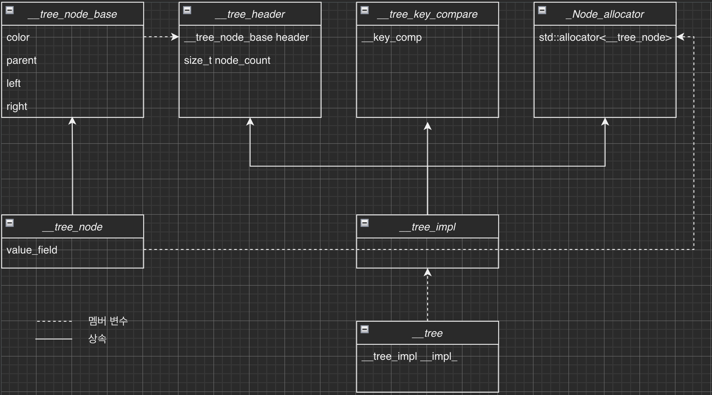
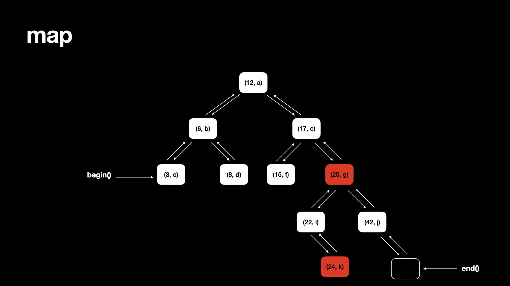
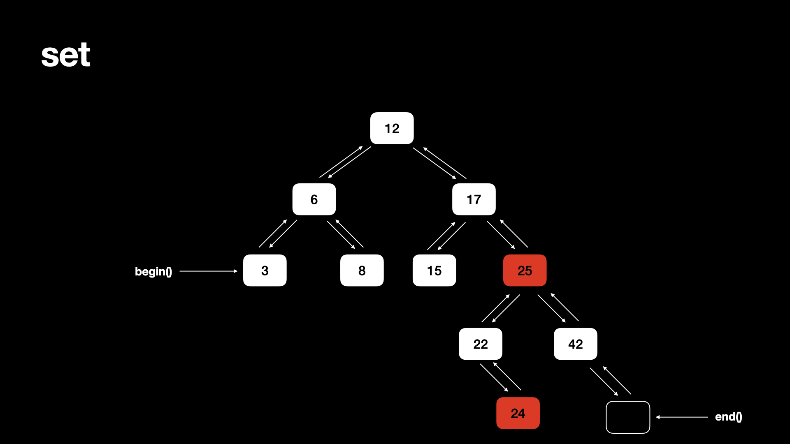

# ft_container

## Goal : C++98 STL Containers 를 재현보자.

1. Vector
2. Map

**각 컨테이너 구현을 위한 도구들**

1. iterator_traits
2. reverse_iterator
3. enable_if(SFINAE)
4. is_integtral
5. equal
6. lexicographical_compare
7. pair
8. make_pair

**요구사항**

- 반복자 체계
- std::allocator 를 데이터 담는 용으로 쓸 것
- 필요시 friend 키워드 사용 가능

## 시작하기

### 1. 컨테이너란 압축되거나, 더해지거나, 정렬, 검색이 가능하도록 조작 가능한 객체들을 담을 수 있는 템플릿 클래스이자 라이브러리이다. 이러한 것이 가능해지는 이유는 반복자의 개념이 있기 때문이다.

### 2. 컨테이너들이 흥미롭기도하고, 강점이 되는 부분은 '복잡성'이라는 특성이다. : 컨테이너에서 요소에 접근하기 위해 얼마나 효과적인가에 대한 생각들은 보통 여기서 나타난다.

### 3. 반복자는 무엇인가. :

포인터를 닮은 객체(Pointer-like object)

C++ STL 에서 핵심적인 3가지 요소는 다음과 같다.

- Containers : 컨테이너들은 특정 종류의 객체의 모음을 관리하기 위해 사용되는 것들을 의미한다. 컨테이너들은 2개의 타입으로 구분된다. 선형 컨테이너<sup>Sequence Containers</sup>(vector, deque, list)와 결합 컨테이너<sup>Associative Containers</sup>(set, Map, Multiset, MultiMap)

- Algorithms : 특정 모음의 원소들을 처리하기 위해 사용되는 것이다. 알고리즘은 컨테이너에서 제공되는 것이며, 사전에 정의된 방식으로 원소들을 처리하고,같은 혹은 다른 컨테이너에 결과를 전달하는 역할을 한다.

- Iterator : 컨테이너라고 불리는 클래스의 객체의 모음의 원소들 전체를 가로지르는 용으로 사용된다. STL의 디자이너들은 아주 훌륭한, 간단하면서도 공통적인 접근 방법을 사용하고 있다. - "데이터와 작업 사이의 분할"

데이터는 쥐어지고, 컨테이너 클래스를 통해 관리된다. 컨테이너를 걸쳐 일어나는 연산작업들은 정형화된 알고리즘에 의해 정의되고 관리된다.

**반복자는 컨테이너 클래스들과 알고리즘 사이의 연결다리/터널/접착제**역할을 한다.

#### 반복자의 다른 범주들은

- Bidirectional
- Random Access
- Input iterators
- Output iterators
- Forward iterators

반복자 알고리즘은 컨테이너 타입에 의존적이진 않다. -> 무슨 의미 일까?

### 4. 자신만의 컨테이너를 만들기 위해

#### 3가지 필수 조건들 :

- Container 인터페이스 요구사항 :

- Allocator 인터페이스 요구사항 :
  allocator class 의 기초 인터페이스는 typdefs, alloocation 의 pair 함수들, allocate(), deallocate(), 생성자, 소멸자 멤버들의 pair, 생성자와 소멸자들의 집합으로 구성되어 있다. typedef는 포인터, 참조, 크기 및 차이의 모양을 결정하기 위해 컨테이너에서 사용되며 차이는 두 포인터 사이의 거리를 의미합니다.

- Iterator 요구사항 :

### 5. `*.traits` 란?

Traits 들은 컴파일 타임에 type 정보를 제공해주기 위해 사용하는 아주 강력한 도구이다. trait은 type을 특성화 하는 크래스 또는 클래스 템플릿으로 템플릿 매개변수일 수 있다. trait은 일반적으로 런타임 오버헤드 없이 유형정보를 제공할 수 있는 템플릿 메타프로그래밍을 사용하여 구현된다. Trait 은 프로그래머에 의해 채택된 C++ 컨벤션이며, 이것들은 또한 항상 **struct** 로 구현된다.

## Vector container

벡터는 동적으로 조정되는 배열이 캡슐화 되어 있는 순차적 컨테이너<sup>sequential container</sup>이다. 데이터 원소는 연결된 저장소 안에 저장된다. 데이터 원소는 끝에 삽입되며, 원소들은 다음과 같이 접근 될 수 있다.

- iterator / reverse iterator : 다른 객체를 가리키는 객체
- classical pointers

벡터의 시간복잡도는작업에 따라 다르다.

- 원소에 접근 : O(1)
- 원소 삽입 : `pop_back()`을 사용시 O(n), 배열이 확장이 필요하여 `push_back`이 들어가면 O(1)이 된다.

컨테이너 어뎁터 : 일부 기능(스택<sup>stack</sup>, 대기열<sup>queue</sup>, 우선순위 대기열<sup>priority queue</sup>)으로 제한된 벡터

벡터의 클래스 템플릿 : `template<class T, class Alloc = allocator> cass vector`

### 참고자료

- [Conteneurs STL](https://www.lirmm.fr/~ducour/Doc-objets/ISO+IEC+14882-1998.pdf)
- [Allocator](https://medium.com/@vgasparyan1995/what-is-an-allocator-c8df15a93ed)
- [Member type](https://stackoverflow.com/questions/37714566/what-do-member-types-mean-in-vectors)
- [개쩌는 깃헙](https://github.com/yongjulejule/ft_containers/tree/fa4e0535dcdd04d911ac8c2ae5bf5c8e0cdd73d7#ft_containers)
- [Traits](https://h-deb.clg.qc.ca/Sujets/Divers--cplusplus/Traits.html) -[Vectors](https://www.scaler.com/topics/cpp/vector-in-cpp/)
- [C++ 스타일 가이드\_Google](https://google.github.io/styleguide/cppguide.html)
- [LLVM libcxx source code(github)](https://github.com/llvm/llvm-project/tree/main/libcxx)
- [gnu source code(github)](https://github.com/gcc-mirror/gcc/tree/master/libstdc%2B%2B-v3/include/bits)
- [gnu docs](https://gcc.gnu.org/onlinedocs/gcc-11.2.0/libstdc++/api/files.html)

### Vector 를 위한 용어들

- Modifiers : 벡터의 컨테이너의 구조체를 수정하는 함수들
- Allocator : 컨테이너들 내부에서 메모리 할당을 넘어 프로그래머에게 제어권을 제공한다.

### 다른 동적 시퀀스 컨테이너 대비 특징과 단점

- 특징 : Vector들은 원소들에 접근하는 것이 매우 효율적이고, 상대적으로 끝 부분에 원소를 넣거나, 제거하는 것이 효과적이다.

- 단점 : 끝 이외의 위치에 요소를 삽입하거나 제거하는 것의 경우 다른 작업보다 성이 떨어지며, 목록 및 foward_list 보다 일관성이 떨어지는 반복자와 참조가 있다.

### 공통 용어 집

- namespaces<br>
  C++ 에서, namespace 는 연관된 이름 혹은 구분자의 모음을 말한다. 이것들은 이러한 구분자들을 유사한 다른 namespace나 혹은 전역 namespace 와 대비하여 구별시켜준다. C++ 의 표준 라이브러리의 구분자는 std 불려진다.

- Typdef 와 Typename<br>
  typedef typename \_MyBase::value_type value_typ;<br>
  value_type v;<br>
  typedef 는 내 코드에서 새로운 타입을 정의내리는 것이다.<br>
  typename 은 value_type 이 type이라는 것을 컴파일러에게 알려준다. 그리고 \_MyBase 의 static member 가 아니라고 알려주는 역할을 한다. :: 는 type의 범위를 의미한다. 이것은 ~안에 있다 는 의미에 가까워서 value_type 이 \_MyBase 안에 있다는 의미로 해석이 되거나 혹은 포함되어있다고 생각될 수 있다.

- Allocator-aware : 동적으로 컨테이너 저장소의 필요를 처리하는 객체

- Range access 란 무엇인가?
  고 수준의 레벨에서, range 는 반복할 수 있는 무언가까지를 말한다. 예를 들어 벡터나, 리스트와 같은 컨테이너들이 range이다. 범위를 가지고 있으면서,std::ranges::sort(myVector); 를 호출하는 것이 가능한데, 이것은 std::sort(MyVector.begin(), myVector.end()); 를 호출한 것처럼 처리된다. 라이브러리의 범위 안에서, 알고리즘은 매개변수로써 범위를 취한다. (비록 그것들은 당신이 원한다면, 반복자를 취할수도 있다.) 대상들은 모음 안에서 직접 수행될 수도 있다.

- compile time vs running time
  Compile time : 컴파일 타임에 에러가 검출된다.(.cpp 에서 .o로)
  Running time : running 혹은 execution 타임에 에러가 발견된다.

- Generic programming / SFINAE
  Generic programming 이란 다른 데이터의 타입들에 동일한 알고리즘을 정의하는 방법론이다. 이 역시 일종의 다형성으로(type polymorphism, type setting), SFAINAE에 기반을 두고 있다. SFAINAE : Substitution Failure is not an Error. (치환 실패는 에러가 아니다) <br>SFINAE 는 컴파일러가 유효하지 않은 타입 혹은 표현을 템플릿 인스턴스화 과정에서, 유효하지 않은 코드를 무시하거나, 컴파일 에러를 생성하기 보다 컴파일 프로세스를 지속해버린다는 생각에서 기반을 두고 있다. 이 원칙은 내가 type 기반의 디스패칭 및 조건 논리를 수행하기 위해 템플릿 메타 프로그래밍을 사용하는 코드를 쓰는 것을 가능케 만들어준다.

- 메타 프로그래밍에서의 메타데이터
  데이터는 단순히 정보, 측정 또는 관찰 목록, 스토리 또는 특정 항목에 대해 설명할 수 있다. 메타 데이터는 데이터의 **특성과 특성을 식별하는데 도움이 되는 데이터에 대한 관련 정보를 지정하며, 사용된 유형에 대해 프로그램에서 사용할 수 있는 정보를 말한다.**

- Functor(Function Object)<br>
  `function + object`의 합성어로, `operator()`오버로딩을 통해 함수처럼 작동하는 클래스(구조체)를 만들고, 객체를 함수처럼 사용하는 것.
  이러한 functor 는 STL의 알고리즘용으로 쓰인단다.

```cpp
struct Add {
	Add(int toAdd) : _toAdd(toAdd) {}
	int operator() (int x) {
		return x + _toAdd;
	}
	private:
	int _toAdd;
};

int main() {
	Add add_42(42); // state 저장
	Add add_13(13);

	int result_42 = add_42(2);
	int result_13 = add_13(2);

	std::vector<int> v(10, 10);
	std::transform(v.begin(), v.end(), add_42);
}
```

- Functor의 분류

  - genrator : 인자 없이 사용하는 functor
  - unary : 하나의 인자를 필요로 하는 functor
  - binary : 두개의 인자를 필요로 하는 functor
  - predicate : boolean 값을 리턴하는 functor, Unary predicate, Binary predicate 등으로 혼합해서 쓴다.
  - operator : 연산 값을 리턴하는 functor

- functor vs function

  - functor는 객체에 () 연산자를 오버로드 한 형태로 함수처럼 작동하는 객체.
    - 객체이므로 인자로 넘길 수 없고 [callback](https://satisfactoryplace.tistory.com/18) 형태로 사용할 수 있다.
  - callback 형태이기 때문에 STL 알고리즘과 호환성이 좋다.
  - state 를 저장 할 수 있다.
  - function은 특정 함수의 인자로 넘기기 위해선 다른 작업을 해줘야 한다.(함수 포인터나, 함수 객체화)

- functor vs function pointer

  - functor 는 type 이 명확하게 정의됨
    - 따라서 템플릿의 인자로도 사용할 수 있다.
    - 컴파일 단계에서 최적화가 가능하여 [inline](https://hwan-shell.tistory.com/85) 화가 가능하다.
  - state를 저장할 수 있으니, 일반 멤버 변수 / 함수 또한 가질 수 있다.
  - structure 나 class 를 만들어야 해서 코드 양이 상대적으로 많다.
  - funtion pointer 는 type 만 같다면 다른 function 도 들어갈 수 있다.
  - 컴파일시 판별되는게 아닌, 런 타임에서 함수가 판별되므로 오버헤드가 있고, inline 화 불가능하다.
  - state를 저장할 수 없다.

- functor vs lambda expression(C++11)

  - 해당 내용까지 깊게 들어가다간 끝이 안날 것 같아서제외...

- stack unwinding

  - 스택에서 함수 진행 중, exception 이 발생하면 catch 를 찾아 가면서 call stack 을 되돌아가게 되고, 이때 콜 스택 하나 하나를 빠져나오면서 정리해주는 기술, 그렇게 하지 않을 경우 할당된 메모리가 있다면 릭이 발생하게 된다. 반드시 exception 에 대응하는 부분마다 고려해줘야 한다.
  - 대표적인 해결책이 [RAII](https://hwan-shell.tistory.com/207) 다
  - 릭 나는 구조는 다음과 같다.

  ```cpp
  void f3() {
  	int *c = new int[100];
  	std::string s = "this is stack....";
  	throw "exception!";
  }

  void f2() { f3() }

  void f1() {
  	try { f2() } catch(...) { std::cout << "back top here" << std::endl;}
  }
  ```

  - 이 경우 스택은 `f1->f2->f3`로 쌓이고 되돌아가게 되는데, 스택 해제 과정에서 `*c`는 해제 되지 못함.
  - RAII 보장하는 형태로 이를 구현하면, 나가면서 메모리 해제가 보장된다. 예시는 아래와 같다.

  ```cpp
  void f3() {
  	int *c = new int[100];
  	std::unique_ptr<int> q(c); // 알아서 에러를 해제할 수 있게 되고, 릭을 해소해준다.
  	std::string s = "this is stack....";
  	throw "exception!";
  }

  void f2() { f3() }

  void f1() {
  	try { f2() } catch(...) { std::cout << "back top here" << std::endl;}
  }
  ```

- dynamic exception specification(deprecated C++11, removed C++17)

  - `throw(expression)`을 통하여 특정 함수가 어떤 exception을 던지는 지 설정하는 용도.
  - 여기서 특정한 exception으로 만들지 않으면 `std::unexpected`가 작동함.
  - `throw()` 의 형태로 쓰면, 해당 함수는 exception을 던지지 않는 다는 의미가 되어버림.
  - 특징적으로 프로그래머의 의도를 함수에 녹여내고, 알수 있게 만든다. 컴파일러 상에서 최적화도 된다고...
  - 하지만 문제시 되어 삭제됨[참고사항](https://stackoverflow.com/questions/13841559/deprecated-throw-list-in-c11)
    - 런타임 시 체크되어서 프로그래머가 모든 runtime-failure 를 다룰 수 없다.
    - 오히려 런타임 오버헤드를 발생시킨다.
    - generic code 에서 사용성이 떨어지고, 해당 함수가 던질 수 있는 exception이 늘면, 고쳐야 할게 많아짐.
    - 실제로 함수가 아무 exception이나 던지거나(throw(...) 이 없을 때) 또는 exception을 절대 던지지 않는 상황(throw())에서만 최적화가 가능하다.
    - 이에 맞게 [noexcept](https://en.cppreference.com/w/cpp/language/noexcept_spec)로 대체됨
    - 따라서 직접 구현시에는 `#define FT_NOEXCEPT thorw()` 로 `noexcept`를 대체해본다.
  - std::unexpected
    - `std::unexpected_handler`가 실행되면, 기본핸들러가 `std::terminate` 이므로 `std::abort()` 를 통해 프로그램이 종료됨.

- Exception safety

```plain
	원문
	The C++ standard library provides a generally useful conceptual framework for design for exception-safe program components. The library provides one of the following guarantees for every library operation:

	The basic guarantee for all operations: The basic invariants of all objects are maintained, and no resources, such as memory, are leaked. In particular, the basic invariants of every built-in and standard-library type guarantee that you can destroy an object or assign to it after every standard-library operation (§iso.17.6.3.1).
	The strong guarantee for key operations: in addition to providing the basic guarantee, either the operation succeeds, or it has no effect. This guarantee is provided for key operations, such as push_back(), single-element insert() on a list, and uninitialized_copy().
	The nothrow guarantee for some operations: in addition to providing the basic guarantee, some operations are guaranteed not to throw an exception. This guarantee is provided for a few simple operations, such as swap() of two containers and pop_back().
	Reference : The c++ Programming language, 4rd edition
```

- 이걸 정리한 사람 분의 [참고글](https://scvgoe.github.io/2019-07-06-Exception-Safety/)
- 개념 : 2000년 David Abrahams 는 본인의 저서(Exception-Safety in Generic Components)에서 Exception Safety Guarantees 라는 개념을 설명했다. 핵심은 class library 설계자와 clients 사이에서 exception handling safety(예외 처리 안전)을 검증하는데 사용하는 일종의 가이드라인을 말한다.
- exception safety 의 수준(안전한 순으로 정렬)
  1. No-throw guarantee(`failure transparency`) : 모든 연산의 성공과 안정성이 보장되는 수준으로 exceptional situation이 발생하면, 이것이 내부적으로 처리되며 clients에게 보이지 않고 역시 성공과 안정성이 보장된다.
  2. Strong exception safety(`commit or rollback semantics`) : 연산 작업이 실패할 수도 있지만, 실패한 연산이 다른 부작용(side effects)들을 야기하지 않는 것이 보장된다. 따라서 모든 데이터는 원래 값을 유지한다.
  3. Basic exception safety(`no-leak guarnatee`) : 실패한 연산작업의 일부 동작이 부작용을 불러오지만, 모든 invariants(불변 값?) 들은 항상 보존되고, 메모리 누수를 비롯해 어떠한 자원의 누수도 발생하지 않음을 보장한다.
  4. No exception safety : 어떠한 것도 보장되지 않는 수준, 일반적으로 견고한 코드를 위해서는 적어도 기본적인 exception safety 이상의 수준이 요구 된다. Excetpion safety 의 핵심은 코드의 block 이 실행되고 난 뒤에도 프로그램의 실행이 계속됨이 보장되어야 한다는 것이다. 몇몇 언어들은 dispose pattern(withm try-with-resources)를 사용하여 이것들을 간단히 할 수 있도록 했다.
- C++ 에서 Exception Safety 를 위한 디자인 방법

  1.  Keep Resource Classes Simple : 수동 리소스를 클래스에서 캡슐화 할 때에는 리소스 관리 이외에는 아무것도 하지 않도록 해야 한다. 가능하면 smart pointer 를 사용해라.
  2.  Use the RAII Idiom to Manage Resources : RAII(Resource Acquisition Is Initialization) Idiom 은 C++ 창시자 Bjarne Stroustrup에 의해 제안된 디자인 패턴이다. C++ 개발자가 직접 resource를 관리해주어야 하는 언어에서 leak 을 방지하기 위한 중요한 기법으로 해당 리소스의 사용 범위<sup>scope</sup>가 끝난 경우 자동으로 해제 해주며 exception이 발생하거나 하는 경우 획득한 자원 해제를 보장해라.

- SAFINAE 추가 설명
  c++에서 컴파일시 타입에 맞는 함수를 찾아가는 과정은 매우 복잡하며, 이 과정에서 수많은 후보가 생김.

  1.  name lookup 을 통하여 함수 이름을 찾음.
  2.  ADL을 통하여 매칭되는 함수를 찾음. (이 과정에서 암시적 형변환이 일어날 수 있음)
  3.  템플릿 함수는 타입이 정해지지 않았으므로 인스턴스화가 될 필요가 있음.
  4.  명시적 혹은 암시적으로 템플릿 함수가 인스턴스화가 되지만, 항상 템플릿의 모든 인자가 정해지지는 않음.
  5.  이때 가능하다면, 컴파일러가 템플릿의 인자를 추론함(Template argument deduction)
  6.  이렇게 candidated function set이 생성되는데 둘 이상의 함수가 후보가 될 수 있음
  7.  목록에서 함수의 인자들을 치환하는데, 이때 타입이나 표현상의 문제가 있으면 치환에 실패함
  8.  치환에 실패할 시 컴파일 에러를 내지 않고, 해당 후보 함수를 후보군에서 제외하는 방식으로 작동!(SFINAE)
  9.  overload resolution을 통하여 실제로 호출한 함수를 찾음!
  10. 이때, 함수의 후보들을 candidate functions, 실제 호출되는 함수는 viable function이라고 부름!

- [name lookup](https://en.cppreference.com/w/cpp/language/lookup)
  - [unqualified name lookup](https://en.cppreference.com/w/cpp/language/unqualified_lookup)
  - [qualified name lookup](https://en.cppreference.com/w/cpp/language/qualified_lookup)
- [ADL (Argument Dependent Lookup)](https://en.cppreference.com/w/cpp/language/adl)
- [template argument deduction](https://en.cppreference.com/w/cpp/language/template_argument_deduction)
- [template argument substitution](https://en.cppreference.com/w/cpp/language/function_template#Template_argument_substitution)
- [overload resolution](https://en.cppreference.com/w/cpp/language/overload_resolution)
- ⚠️ Default Argument Do Not Participate in Overload Resolution
  - Default Argument 는 overload resolution에 포함되지 않음!!!!!

[function overloading with default parameter](https://stackoverflow.com/questions/53376620/function-overloading-with-default-parameter-in-c)
[why SFINAE doesn't work in right side in default function argument](https://stackoverflow.com/questions/24909652/why-sfinae-doesnt-work-in-right-side-in-default-function-arguments)

- enable_if

  - SFINAE를 활용하여 특정 조건에 해당하는 템플릿 함수를 호출하게 만들어주는 도구

  ```cpp
  template<bool B, class T = void>
  struct enable_if {};

  template<class T>
  struct enable_if<true, T> { typedef T type; }
  ```

---

## Convention

- STL 의 메소드에 맞게 snake_case 사용 해보기
- 공식문서 내용을 최대한 참조한 레퍼런스들, 이것처럼 구현해보자
- 라이브러리에서만 사용되는 메소드, 클래스는 `__class_name` 과 같은 형태로 작성한다
- 외부에 공개되지 않는 변수는 `_variable_name` 과 같은 형태로 작성한다.
- [google style guide](https://google.github.io/styleguide/cppguide.html)를 따라가자.
- private class : `__class_name`
- private type : `_Type_Name`
- private member variable : `_variable_name`
- private local : `__variable_name`

---

# C++ std::allocator

default allocator 로, STL containerㅔ서 사용하는 allocator를 제공하며 특정 allocator 가 제공되지 않으면 `std::allocator`가 사용된다.

## Prototype

```cpp
/**
 * @brief default allocator
 * @tparam T: type of the elements allocated by the object
 **/
template<class T> class allocator;
```

## Member types:

```cpp
typedef T value_type;
typedef T* pointer;
typedef T& reference;
typedef const T* const_pointer;
typedef const T& const_reference;
typedef std::size_t size_type;
typedef std::ptrdiff_t difference_type;

// 주어진 타입이 아닌 다른 타입으로 할당하기 위함.
typedef template<class U> struct rebind{ typedef allocator<U> other; } rebind;
```

## Member functions:

```cpp
// (constructor): Construct allocator object (public member function )
allocator() throw();
allocator(const allocator& alloc) throw();
template <class U>
allocator(const allocator<U>& alloc) throw();

// (destructor): Allocator destructor (public member function )
~allocator() ;

// address:  Return address (public member function )
pointer address(reference x) const;
const_pointer address(const_reference x) const;

// allocate:  Allocate block of storage (public member function )
// @param hint: 0이 아니면, 이전에 할당한 공간의 가장 가까운 곳에 할당해주기 위한 힌트가 됨!
pointer allocate (size_type n, allocator<void>::const_pointer hint=0);

// deallocate:  Release block of storage (public member function )
// @param n: 이전에 allocate를 이용하여 할당한 공간과 크기가 다르면 UB임!
void deallocate (pointer p, size_type n);

// max_size: Maximum size possible to allocate (public member function )
size_type max_size() const throw();

// construct: Construct an object (public member function ). 할당되었던 p 메모리에 val을 씀
void construct(pointer p, const_reference val);

// destroy: Destroy an object (public member function )
void destroy( pointer p ); // Calls ((T*)p)->~T()
```

---

# C++ std::vector

## Prototype :

```cpp
/**
 * @brief generic template of vector
 * @tparam T: type of the elements. Must meet the requirements of
 * CopyAssignable and CopyConstructible
 * @tparam Allocator: type of the allocator that is used to acquire/release
 * memory and to construct/destroy the elements in that memory
 * Must meet the requirements of Allocator
 *
 **/
template <class T, class Allocator = std::allocator<T> > class vector;
```

## Member types :

```cpp
typedef T value_type;

// default to allocator<value_type>
typedef Allocator allocator_type;
typedef typename allocator_type::pointer pointer;
typedef typename allocator_type::const_pointer const_pointer;
typedef typename allocator_type::reference reference;
typedef typename allocator_type::const_reference const_reference;

// same to std::size_t when Allocator is std::allocator
typedef typename allocator_type::size_type size_type;

// same to std::ptrdiff_t when Allocator is std::allocator
typedef typename allocator_type::difference_type difference_type;

// a random access iterator to value_type
typedef __vector_iterator<pointer> iterator;

// a random access iterator to const value_type
typedef __vector_iterator<const_pointer> const_iterator;

typedef ft::reverse_iterator<iterator> reverse_iterator;
typedef ft::reverse_iterator<const_iterator> const_reverse_iterator;
```

## Member functions :

- constructor :

  - exception safety : Strong
  - (first, last) 가 정상적이지 않으면 UB
  - `allocator::constructor` 가 정상적이지 않으면 UB

  ```cpp
  // default constructor which constructs an empty container
  explicit vector(const allocator_type& alloc = allocator_type());

  // fill constructor which constructs a container with n elements with value val
  explicit vector(size_type n, const value_type& val = value_type(),
  		const allocator_type& alloc = allocator_type());

  // range constructor which constructs a container with range first to last
  template <class InputIterator>
  vector (InputIterator first, InputIterator last,
  		const allocator_type& alloc = allocator_type());

  // copy constructor which constructs a container with the copy of the container
  vector (const vector& other);
  ```

- template specialization for constructor:

  ```cpp
  // InputIterator는 uninitialized_* 을 사용할 수 없어서 하나씩 push_back를 해야함!
  template <typename _T, typename _Allocator>
  template <typename _InputIterator>
  vector<_T, _Allocator>::vector(
  	_InputIterator first,
  	typename enable_if<__is_input_iterator<_InputIterator>::value &&
  						!__is_forward_iterator<_InputIterator>::value,
  					_InputIterator>::type last,
  	const allocator_type& _Alloc);

  // ForwardIterator 부터는 uninitialized_* 를 사용할 수 있어 한번에 초기화 가능!
  template <typename _T, typename _Allocator>
  template <typename _ForwardIterator>
  vector<_T, _Allocator>::vector(
  	_ForwardIterator first,
  	typename enable_if<__is_forward_iterator<_ForwardIterator>::value,
  					_ForwardIterator>::type last,
  	const allocator_type& _Alloc);
  ```

- destructor :

  - 컨테이너 상에 모든 요소를 파괴한다. 그리고 모든 저장 공간의 할당을 해제한다.
  - exception-safety : No-throw

- operator=:

  - 컨테이너에 새로운 컨텐츠를 할당하고, 현재의 컨텐츠를 대체하고, 그리고 그에 따라 크기를 수정한다.
  - exception-safety : Basic
    - `allocator::constructor` 가 정상적이지 않거나, `value_type`이 copy-assignable 하지 않으면 UB

- the container preserve its current allocator -> 재할당용

  ```cpp
  vector& operator=(const vector& rhs);
  ```

### Iterators :

- exception-safety : No-throw
- return 대응 하는 반복자

  ```cpp
  iterator begin() FT_NOEXCEPT;
  iterator end() FT_NOEXCEPT;
  reverse_iterator rbegin() FT_NOEXCEPT;
  reverse_iterator rend() FT_NOEXCEPT;
  ```

### Capacity :

```cpp
// 컨테이너에 저장된 elements의 수를 반환
size_type size() const FT_NOEXCEPT; // No-throw

// 컨테이너에 할당할 수 있는 최대 메모리를 반환
size_type max_size() const FT_NOEXCEPT; // No-throw

// 컨테이너가 가지고 있는 메모리 크기 반환
size_type capacity() const FT_NOEXCEPT; // No-throw

// 컨테이너가 비었는지 여부를 boolean으로 반환
bool empty() const FT_NOEXCEPT; // No-throw

// 컨테이너가 최소한 new_n 만큼의 데이터를 저장하기 위한 메모리를 확보
// n > capacity() 면 재할당, 그렇지 않으면 재할당 x
// n > max_size() 면 length_error throw
// 재할당이 일어나지 않거나, copy constructor가 있으면 strong guarantee
// 그 외에는 basic guarantee
void reserve(size_type __new_n_)

// 컨테이너가 n개의 데이터를 저장하도록 resize.
// n < size()면, n개의 데이터만 저장. 나머지는 제거 -> strong guarantee
// n >= size()면, 남는 공간에 val을 채움  -> No-throw
// n > capacity()면, 현재 메모리만큼 재할당 -> strong guarantee
// val이 copyable하지 않으면 basic guarantee
void resize(size_type __n_, value_type __val_ = value_type());
```

### Element access :

```cpp
// 컨테이너에서 저장된 n번째 데이터를 반환
// size() > n 이면 no-throw. 그 외에는 UB
reference operator[] (size_type __n_)
const reference operator[] (size_type __n_) const;

// 컨테이너에 저장된 n번째 데이터를 반환
// n이 범위를 벗어나면 out_of_range exception 발생
// strong-guarantee
reference at(size_type __n_);
const_reference at(size_type __n_) const;

// 컨테이너에 저장된 첫번째 요소의 레퍼런스 반환
// empty이면 UB. empty가 아니면 no-throw -> LLVM 기준 segmentation fault!
reference front();
const_reference front() const;

// 컨테이너에 저장된 마지막 요소의 레퍼런스 반환
// empty이면 UB. empty가 아니면 no-throw -> LLVM 기준 segmentation fault!
reference back();
const_reference back() const;
```

### Modifiers :

- 모든 method 는 작동후 적절하게 size()를 수정하고, 재할당시 내부 allocator를 사용하여 메모리 할당
- 할당시 allocator::construct에 문제가 있으면 UB
- `iterator validity`(참고 [iterator invalidiation](https://www.geeksforgeeks.org/iterator-invalidation-cpp/))가 있어서 데이터가 수정되는 경우 이전 생성된 iterator 들의 validity에 유의해야 한다.
- range는 [first, last]로 지정한다.
- exception-safety(공통 적용)
  - 재할당이 일어나지 않거나, 재할당이 일어나도 각 요소가 copyable 이면 strong guarantee(1)
    - 재할당이 일어났는데, 각 요소가 copyable 하지 않으면 basic guarantee(2)
  - aloocator::construct 에 문제가 있거나, 인자의 iteerator 가 invalid하면 UB

```cpp
// 벡터에 새로운 데이터를 넣고 size를 알맞게 수정
// 이전 데이터는 모두 destroy되고, 새로운 데이터로 replace됨
// 재할당은 새로운 size > capacity인 상황에만 일어나며 내부의 allocator를 이용
// basic-guarantee를 보장
template <typename _InputIterator>
void assign(_InputIterator first, _InputIterator last); // range
void assign(size_type n, const value_type& val); // fill

// val을 컨테이너 end에 추가. 필요하다면 메모리 재할당.
void push_back(const value_type& val);

// 컨테이너의 마지막 요소를 삭제.
// 컨테이너가 비어있지 않으면 no-throw. 그 외에는 UB
void pop_back();

// position 에 해당하는 값들을 삽입.
// 현재 벡터 size보다 커지게 되면 자동으로 재할당
// iterator를 반환하는 경우, insert된 위치의 iterator 반환
iterator insert(iterator position, const value_type& val); // single element
void insert(iterator position, size_type n, const value_type& val); // fill
// inputIterator면 하나씩 삽입해야 해서 logN의 시간복잡도가 나옴
template <typename _InputIterator>
void insert(iterator position, _InputIterator first, _InputIterator last); // range

// 해당 인자의 element를 destroy하고, size를 줄임
// position이나 range에 end()가 포함되지 않으면, relocate하는 과정이 필요함!
// 마지막으로 지워진 부분의 다음 element가 있는 위치를 리턴
// 이때 iterator는 random_access_iterator
iterator erase(iterator position);
iterator erase(iterator first, iterator last);

// swap data
void swap(vector& x) FT_NOEXCEPT; // no-throw

// 컨테이너에 저장된 모든 데이터를 삭제하고, size를 0으로 설정
void clear() FT_NOEXCEPT; // no-throw
```

### Allocator :

```cpp
// return copy of vector's allocator
allocator_type get_allocator() const FT_NOEXCEPT ; // no-throw
```

### Non-member functions :

- relational operators :

  ```cpp
  bool operator == (const vector<T,Alloc>& lhs, const vector<T,Alloc>& rhs);
  bool operator != (const vector<T,Alloc>& lhs, const vector<T,Alloc>& rhs);
  bool operator <  (const vector<T,Alloc>& lhs, const vector<T,Alloc>& rhs);
  bool operator <= (const vector<T,Alloc>& lhs, const vector<T,Alloc>& rhs);
  bool operator > (const vector<T,Alloc>& lhs, const vector<T,Alloc>& rhs);
  bool operator >= (const vector<T,Alloc>& lhs, const vector<T,Alloc>& rhs);
  ```

- swap() :

  ```cpp
  template <class T, class Alloc>
  void swap (vector<T,Alloc>& x, vector<T,Alloc>& y);
  ```

#### \_\_vector_base

- `__vector_base` 에서 필요한 기능

  - 생성자에서 메모리 획득이 되어야 하며, 소멸자에서 메모리 모두 해재(RAII)
  - 현재 메모리 정보 저장(begin, end, capacity, allocator)
  - 메모리 획득 , 해제
  - 문제 발생시의 적절한 에러 throw

- 이거 왜 필요하냐?
  - `vector` 의 `constructor`는 `strong-quarantee` 여야 한다.
  - `vector` 의 `constructor`가 exception을 던질 시, `destructor`가 호출 되지 않는다.
  - 따라서 이러한 부분을 벡터 내부에서 자원을 얻고 해제하는 과정이 RAII에 따라 잘 작성되어도, 소멸자가 호출되지 않아서 리소스 해제가 제대로 반환 되지 않을 수 있음(`strong-guarantee` 를 만족하지 못한다.)
  - `vector_base`라는 것을 만들어서 자원을 저장하고, vector가 이를 상속 받으면, RAII 구조 처리 및 정상 자원 반납이 가능하다.

#### \_\_vector_base methods

```cpp
// construct n size of memory
pointer __construct_storage(size_type __n_);

// copy data of __vector_base
void __copy_data(__vector_base const& __src_);

// swap data of src and this
void __swap_data(__vector_base& __src_);

// destruct storage (only memory)
void __destruct_storage();

// get current capacity
size_type __capacity() const;

// check whether current capacity is enough to store n elements
size_type __check_size(size_type __n_);
```

#### private member function in vector

```cpp
// push data to end of vector. (not allocate memory)
__construct_one(value_type &__v_); // push_back 하는데, 메모리 용량이 충분할때

// push range of data at specific position
__construct_point(point __pos_, size_type __n_, const_iterator __first_, const_iterator __last_);

// 메모리 재할당 후 내용을 copy
__reconstruct(size_type __new_n_);
```

#### exeptions

- `out_of_range`, `length_error`
- 생성자 할당 실패는 그냥 exception throw, 따라서 max_size() 체크는 필요 없음.

---

# C++ std::stack

- container adaptor 로써 LIFO 형태로 작동하기 위해 고안함.
- 각 요소 접근이 가능한 멤버 함수를 갖고 있는 특정 컨테이너 기반으로 함. 이를 캡슐화 하여 사용함(STL의 경우 deque)
- 이 기반 컨테이너는 다음 멤버 함수가 있어야 한다. 이것을 충족하는 라이브러리는 `vector`, `deque`, `list`이다.
  - empty
  - size
  - back
  - push_back
  - pop_back
- ft_container 에서 구현 시에는 vector를 기반으로 만들 수 있고, 그렇기에 같은 수준의 `exception-safety`를 지닌다.

---

# RB-Tree(set, map의 기반)

- STL의 맵과 set은 sorted associativ container 로 탐색과 삽입, 삭제에 로그 시간의 시간 복잡도를 보장하고, RB-tree로 구현하기가 필수가 되어 있다.

## RB-tree:

1. 모든 노드는 `red`, `black` 이다.
2. `root`노드는 `black`이다.
3. 모든 leaf(NULL) 은 `black`이다.
4. 만약 한 노드가 `red`이면 자식은 `black` 노드들이다.
5. 각 노드에서 leaves까지 simple path 들은 같은 수의 `black`노드를 지난다. `root`노드에서 가장 아래 까지(`leaf` 노드들까지) 어느 경로로 내려가도 같은 수의 `black` 노드를 만나며, 반드시 `root` 노드일 필요없이 어떤 노드를 선택해도 그 노드로부터 끝가지 내려가면 만나는 `black`의 수는 같다.

## 구조

```cpp
struct __tree_node_base;

struct __tree_node;
struct __tree_header;

template <typename _Key_compare>
struct __tree_key_compare;

template <typename _T>
class __tree_iterator : public iterator<bidirectional_iterator_tag, _T>;

template <typename _T>
class __tree_const_iterator : public iterator<bidirectional_iterator_tag, _T>;

template <typename _Key, typename _Val, typename _KeyOfVal,
          typename _Compare = std::less<_Key>,
          typename _Alloc = std::allocator<_Val> >
class __tree {
	struct __tree_impl : public _Node_allocator,
                       public __tree_key_compare,
                       public __tree_header;
};
```



- 참고한 깃헙의 구조
- 트리 노드의 베이스가 되는 `color`, `parent`, `left`, `right` 를 `__tree_node_base`에 저장하고, 컨테이너에 따라 달라지는 `value`는 `__tree_node`에 저장한다.
- `__tree_header`를 만들어 `parent`에 `root`, `left`에 `leftmost`, `right`에 `rightmost`를 저장하여 특정값들에 접근한다.

- 트리를 구성하는 데이터들(`allocator`, `key_compare`, `header`)는 `__tree`의 `nested struct`인 `__tree_impl`에 저장하여 관리한다.

### tree iterator

- 트리의 반복자는 map, set의 규칙에 따라 양방향 반복자<sup>bidirectional_iterator</sup> 이며, 반복자 규칙에 따라 가장 작은 값부터 순서대로 순회 할수 있다.
- 따라서 `begin`은 `leftmost` 이며, `end` 는 `rightmost`의 다음 값으로 접근할 수 있는 빈 노드여야 하고, `increment`, `decrement` 시 `in-order traverse`를 통한 이전, 다음 값이면 됨
- map, set 차이는 set 은 `const` 인 `key` 값 만 갖고, 반복자와 상수 반복자 모두 const가 된다.

### RB-tree Node 알고리즘

```cpp
// in-order 로 다음 노드 반환
__tree_node_base *__tree_increment(__tree_node_base *__x) FT_NOEXCEPT;

// in-order 로 이전 노드 반환
__tree_node_base *__tree_decrement(__tree_node_base *__x) FT_NOEXCEPT;

// 해당 노드로부터 subtree의 leftmost값 반환
__tree_node_base *__minimum(__tree_node_base *__x) FT_NOEXCEPT;

// 해당 노드로부터 subtree의 rightmost값 반환
__tree_node_base *__maximum(__tree_node_base *__x) FT_NOEXCEPT;

// __x 노드 기준으로 left-rotate
void __tree_rotate_left(__tree_node_base *const __x, __tree_node_base *&__root);

// __x 노드 기준으로 right-rotate
void __tree_rotate_right(__tree_node_base *const __x,
                         __tree_node_base *&__root);

// FIXME: insert and delete
// __x를 leaf에 넣은 뒤 __root를 rebalance
// 전제: __root != NULL && __x != NULL
//       __x는 children이 없고, __root와 연결되어 있음.
// 효과: __tree_invariant(end_node->__left_) == true, __root는 바뀌어 있을 수 있음
void __tree_insert_and_fixup(const bool __insert_left, __tree_node_base *__x,
                             __tree_node_base *__p,
                             __tree_node_base &__header) FT_NOEXCEPT;

// __z를 __root 트리에서 제거한 뒤 rebalance
// 전제: __root != NULL && __z != NULL
//       __tree_invariant(__root) == true.
//       __z 는 __root와 연결되어 있음.
// 효과: __tree_invariant(__root) == true, __root는 바뀌어 있을 수 있음.
//       __z는 어느 노드와도 연결되어 있지 않음.
__tree_node_base *__tree_erase_and_fixup(
    __tree_node_base *const __z, __tree_node_base &__header) FT_NOEXCEPT;
```

## Member types:

- `mep`, `set`의 `member type`을 따르며, `node` 타입도 있어야 함.
- `allocator`는 인자로 받는 `allocator` 가 아닌 `Node-type`으로 `rebind`로 해야함

```cpp
 private:
  typedef __tree_node_base *_Base_ptr;
  typedef const __tree_node_base *_Const_base_ptr;
  typedef __tree_node<_Val> *_Link_type;
  typedef const __tree_node<_Val> *_Const_link_type;

 public:
  typedef _Key key_type;
  typedef _Val value_type;
  typedef value_type *pointer;
  typedef const value_type *const_pointer;
  typedef value_type &reference;
  typedef const value_type &const_reference;
  typedef size_t size_type;
  typedef ptrdiff_t difference_type;
  typedef _Alloc allocator_type;

  typedef typename _Alloc::template rebind<__tree_node<_Val> >::other
      _Node_allocator;

  typedef __tree_iterator<value_type> iterator;
  typedef __tree_const_iterator<value_type> const_iterator;
  typedef ft::reverse_iterator<iterator> reverse_iterator;
  typedef ft::reverse_iterator<const_iterator> const_reverse_iterator;
```

- 노드의 타입은 다음으로 구분된다.
  - `Base_ptr` : 트리의 left, right, parent만 필요한 경우
  - `Link_type` : `Base_ptr`에 트리의 값까지 필요한 경우
  - `iterator` : `Link_type`에 각종 연산자까지 필요한 경우

## Member functions:

- 트리의 멤버 함수를 기반으로 map, set의 멤버 함수들이 작동하므려로, 컨테이너가 갖고 있는 기능을 구현해야 한다.

### constructor :

- mep, set에 따라 `strong-guarantee`를 보장해야함.
- 필요 정보는 `impl`저장 되어 있으므로 `impl`을 잘 설정해주면됨

```cpp
public:
   __tree () {}; // can't construct without suitable arguments
   __tree (const _Compare& comp, const allocator_type& alloc = allocator_type())
       : __impl_(comp, alloc) {};
   __tree (const __tree& other) : __impl_(other.__impl_) { __copy_tree(other);};
```

---

# C++ std::map, std::set




- `map`, `set` 은 `associative container` 로써 탐색을 빠르게 진행할 수 있는 자료구조다. 두 커네이너 모두 유일한 `key`를 가지지만, `map`의 경우 `key-value`의 `pair`로 저장되고 `set`은 `key`만 존재함.
- 모든 `key`는 `const`이며, `insert`, `remove` 만 가능하다.
- `set`은 `key`만 갖고 있어 `iterator` 가 `const_iterator`다.

## Prototype :

```cpp
template < class _Key,                                              // map::key_type
           class _T,                                                // map::mapped_type
           class _Compare = std::less<Key>,                         // map::key_compare
           class _Alloc = std::allocator<ft::pair<const Key,T> >    // map::allocator_type
           > class map;

template < class _Key,                             // set::key_type/value_type
           class _Compare = std::less<T>,        // set::key_compare/value_compare
           class _Alloc = std::allocator<T>      // set::allocator_type
           > class set;
```

## Member types :

```cpp
public:
   typedef _Key key_type;
	 typedef _Key value_type; // for set
   typedef _T mapped_type; // for map
   typedef _Compare key_compare;
	 typedef _Compare value_compare; /// for set
   typedef _Alloc allocator_type;
   typedef ft::pair<const key_type, mapped_type> value_type;

private:
   typedef __tree<key_type, value_type, ft::select_first<value_type>,
                 key_compare, allocator_type> // for map
   typedef __tree<key_type, key_type, ft::identify<value_type>,
                 key_compare, allocator_type> // for set
      __base;

public:
   typedef typename allocator_type::reference reference;
   typedef typename allocator_type::const_reference const_reference;
   typedef typename allocator_type::pointer pointer;
   typedef typename allocator_type::const_pointer const_pointer;

   typedef typename __base::iterator iterator;
   typedef typename __base::const_iterator iterator; // for set
   typedef typename __base::const_iterator const_iterator; // for map
   typedef typename __base::reverse_iterator reverse_iterator;
   typedef typename __base::const_reverse_iterator reverse_iterator; // for set
   typedef typename __base::const_reverse_iterator const_reverse_iterator; // for map
   typedef typename __base::difference_type difference_type;
   typedef typename __base::size_type size_type;
   class value_compare // for map
      : public std::binary_function<value_type, value_type, bool> {
    friend class map<_Key, _T, _Compare, _Alloc>;

   protected:
    _Compare comp;
    value_compare(_Compare c) : comp(c) {}

   public:
    bool operator()(const value_type& x, const value_type& y) const {
      return comp(x.first, y.first);
    }
   };
```

## Member functions :

- 대부분의 멤버함수가 map / set 에서 동일하니, 다른 부분만 별도 표기

### constructor :

- exception-safety: strong
- [first, last] 가 정상적이지 않으면 UB
- allocator::construct가 정상 작동 안하면 UB

```cpp
// empty constructor.
explicit map (const key_compare& comp = key_compare(),
              const allocator_type& alloc = allocator_type());

// range constructor insert [first , last) to container
template <class InputIterator>
map (InputIterator first, InputIterator last,
       const key_compare& comp = key_compare(),
       const allocator_type& alloc = allocator_type());

// copy constructor
map (const map& x);
```

### descructor

- exception-safety : no-throw

```cpp
// destroy all element and deallocate all storage
~map();
```

### operator=:

- exception-safety: basic
- allocator::construct 가 정상적이지 않으면 UB
- value_type 이 copy assignable 하지 않으면 UB

```cpp
// destroy nodes and assign new nodes
map& operator=(const map& x);
```

### iterators :

- exception-safety: no-throw
- return 은 대응하는 반복자

```cpp
iterator begin() FT_NOEXCEPT;
iterator end() FT_NOEXCEPT;
reverse_iterator rbegin() FT_NOEXCEPT;
reverse_iterator rend() FT_NOEXCEPT;
```

### Capacity:

- exception-safety: no-throw

```cpp
// 컨테이너에 저장된 elements의 수를 반환
size_type size() const FT_NOEXCEPT;

// 컨테이너에 할당할 수 있는 최대 메모리를 반환
size_type max_size() const FT_NOEXCEPT;

// 컨테이너가 비었는지 여부를 boolean으로 반환
bool empty() const FT_NOEXCEPT;
```

### Element access:

- set 은 value가 key 밖에 없고, 수정이 불가하므로 `operator[]` 가 정의되어 있지 않음
- exception-safety: strong
- allocator::construct 가 정상적이지 않으면 UB
- mapped_type 이 default-constructible 하지 않으면 UB

```cpp
// k에 해당하는 value의 레퍼런스를 리턴, 만약 k가 존재하지 않는다면 insert
mapped_type& operator[](const key_type& k);
```

### Modifiers:

- position 이나 range 가 정상적이지 않으면 UB
- allocator::construct 가 정상적이지 않으면 UB

````cpp
// val을 적절한 위치에 삽입.
// 만약 중복된다면 (중복된 원소의 위치, false) 반환
// 성공한다면 (삽입한 원소의 위치, true) 반환
pair<iterator,bool> insert (const value_type& val); // strong-guarantee

// insert with hint
// hint 근처부터 삽입할 위치를 찾아 삽입
// 만약 중복된다면 중복된 원소의 위치 반환
// 성공한다면 삽입한 원소의 위치 반환
iterator insert (iterator position, const value_type& val); // strong-guarantee

// [first, last) 범위 내 element들을 map에 삽입.
template <class InputIterator>
void insert (InputIterator first, InputIterator last); // basic-guarantee


// position에 있는 노드 삭제
void erase (iterator position); // strong-guarantee

// k 에 해당하는 노드 삭제
// set에선 key_type이 아니라 value_type로 정의되어 있지면 결국 같음
// 지워진 노드의 수를 반환하는데, unique한 key를 가지므로 1 혹은 0 임
size_type erase(const key_type &k); // strong-guarantee

// [first, last) 범위의 노드 삭제.
void erase(iterator first, iterator last); // basic-guarantee

// 데이터 스왑. allocator와 comparison object도 swap 할지 여부는 undefined
void swap(map & x); // no-throw

// 컨테이너의 모든 element destroy
void clear(); // no-throw

### Observers:
- exception-safety : strong
- 해당 comparison object 의 복사본을 반환

```cpp
key_compare key_comp() const;
value_compare value_comp() const;
````

### Operations:

- exception-safety: strong
- 인자로 받은 값이 특정 키와 같은지 아닌지비교할 때, 두 개의 키 a, b가 comp(a, b)== false && comp(b, a) == false)면 같다고 여김
- map과 set의 프로토 타입이 다소 다름. 이는 set의 모든 반복자가 const이기 때문이다.
- 결국 const인 꼴의 set만 존재하는 것이다.(C++98 한정, C++11에선 const_iterator 꼴이 별도로 생김)

```cpp
// val의 위치를 찾아 iterator를 리턴, 못찾으면 end() 리턴
iterator find(const key_type &val); // for map
const_iterator find(const key_type &val) const; // for map
iterator find(const value_type &val) const; // for set

// 컨테이너 안에서 k 와 같은 요소의 수를 리턴한다.
// 모든 element가 unique 하므로 1 혹은 0만 리턴될 수 있음.
size_type count(const key_type & k) const;

// key_comp(element, k)가 처음으로 false를 리턴하는 element의 iterator를 리턴
// 결국 k가 존재하면 k의 이터레이터가 반환되고 존재하지 않으면 k보다 큰 첫 element의 이터레이터 반환
// 조건에 맞는 노드가 없으면 end() 반환
iterator lower_bound(const key_type &k); // for map
const_iterator lower_bound(const key_type &k) const; // for map
iterator lower_bound(const value_type &k) const; // for set

// key_comp(k, element)가 처음으로 true를 리턴하는 노드의 iterator 리턴
// 조건에 맞는 노드가 없으면 end() 반환
iterator upper_bound(const key_type &k); // for map
const_iterator upper_bound(const key_type &k) const; // for map
iterator upper_bound(const value_type &k) const; // for set

// pair(lower_bound(k), upper_bound(k))를 반환.
pair<iterator, iterator> equal_range (const key_type &k); // for map
pair<const_iterator, const_iterator> equal_range (const key_type &k) const; // for map
pair<iterator, iterator> equal_range (const key_type &k) const; // for set
```

### Allocator:

```cpp
// allocator 리턴
allocator_type get_allocator() const; // no-throw
```

### Non-member functions:

- relational operators:

  ```cpp
  bool operator == (const map<Key, T, Comp, Alloc>& lhs, const map<Key, T, Comp, Alloc>& rhs);
  bool operator != (const map<Key, T, Comp, Alloc>& lhs, const map<Key, T, Comp, Alloc>& rhs);
  bool operator <  (const map<Key, T, Comp, Alloc>& lhs, const map<Key, T, Comp, Alloc>& rhs);
  bool operator <= (const map<Key, T, Comp, Alloc>& lhs, const map<Key, T, Comp, Alloc>& rhs);
  bool operator > (const map<Key, T, Comp, Alloc>& lhs, const map<Key, T, Comp, Alloc>& rhs);
  bool operator >= (const map<Key, T, Comp, Alloc>& lhs, const map<Key, T, Comp, Alloc>& rhs);
  ```

- swap()

  ```cpp
  void swap (map<Key, T, Comp, Alloc>& x, map<Key, T, Comp, Alloc>& y);
  ```
